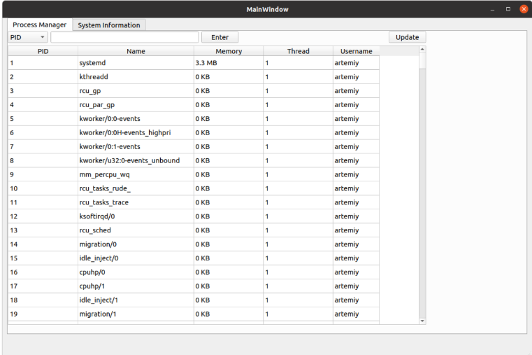
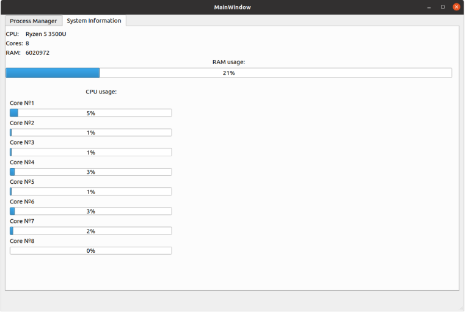

# Требования к проекту
---

# Содержание
1 [Введение](#intro)  
1.1 [Назначение](#appointment)  
1.2 [Бизнес-требования](#business_requirements)  
1.2.1 [Исходные данные](#initial_data)  
1.2.2 [Возможности бизнеса](#business_opportunities)  
1.2.3 [Границы проекта](#project_boundary)  
1.3 [Аналоги](#analogues)  
1.3.1 [Отличия от аналогов](#analogues_differences)  
2 [Требования пользователя](#user_requirements)  
2.1 [Программные интерфейсы](#software_interfaces)  
2.2 [Интерфейс пользователя](#user_interface)  
2.3 [Характеристики пользователей](#user_specifications)  
2.3.1 [Классы пользователей](#user_classes)  
2.3.2 [Аудитория приложения](#application_audience)  
2.3.2.1 [Целевая аудитория](#target_audience)  
2.4 [Предположения и зависимости](#assumptions_and_dependencies)  
3 [Системные требования](#system_requirements)  
3.1 [Функциональные требования](#functional_requirements)  
3.1.1 [Основные функции](#main_functions)  
3.1.1.1 [Отображение списка процессов системы и загруженности системы](#show_list_of_processes)  
3.1.1.2 [Обновление списка процессов](#update_list_of_processes)  
3.1.1.3 [Сортировка списка процессов и поиск по названию](#sort_list_of_processes)  
3.1.1.4 [Завершение выполнения процесса](#crash_process)
3.1.2 [Ограничения и исключения](#restrictions_and_exclusions)  
3.2 [Нефункциональные требования](#non-functional_requirements)  
3.2.1 [Атрибуты качества](#quality_attributes)  
3.2.1.1 [Требования к удобству использования](#requirements_for_ease_of_use)  
3.2.2 [Внешние интерфейсы](#external_interfaces)  
3.2.3 [Ограничения](#restrictions)  
3.3 [Расширение функционала приложения](#extensions)
3.3.1 [Выбор темы](#extensions_dark_mode)
3.3.2 [Ограничение доступа к завершению выполнения процесса](#extensions_restrictions)
3.3.3 [Сохранение списка процессов и загруженности системы в файл](#extensions_save_to_file)

<a name="intro"/>

# 1 Введение

<a name="appointment"/>

## 1.1 Назначение
Документ разработан для однозначной трактовки требований между разработчиком и заказчиком.  Необходимо разработать desktop приложение с простым функционалом и актуальной информацией о запущенных приложениях и процессах, выполняющихся на данный момент в системе.
В этом документе описаны функциональные и нефункциональные требования к desktop приложению «Flow&Process Manager» для операционной системы Linux. Этот документ предназначен для команды, которая будет реализовывать и проверять корректность работы приложения. 

<a name="business_requirements"/>

## 1.2 Бизнес-требования

<a name="initial_data"/>

### 1.2.1 Исходные данные
В нынешнее время всё больше и больше разработчиков программного обеспечения стремятся к созданию максимально дружелюбного пользовательского интерфейса с целью привлечения большего количества потенциальных пользователей к своему продукту и обеспечения наибольшего комфорта при использовании их приложений. Однако, несмотря на данную тенденцию, всё ещё остаются приложения, интерфейс которых либо тяжёл для освоения простому обывателю, либо вообще отсутствует. Ярким примером является терминал операционной системы Linux, который предоставляет огромный простор для взаимодействия с окружением, но мало того, что там отсутствует пользовательский интерфейс как таковой, он также требует знания обширного списка команд для работы с ним.

<a name="business_opportunities"/>

### 1.2.2 Возможности бизнеса
При переходе на операционную систему Linux рядовые пользователи начинают испытывать трудности из-за не самого простого в некоторых аспектах интерфейса системы. Также, помимо этого, при желании пользователя взаимодействовать с операционной системой на более глубоком программном уровне, он неизбежно столкнётся с терминалом Linux, который хоть и является довольно мощным инструментом работы с системой, всё же требует наличия некоторых навыков и знаний для работы с ним, с целью избегания ситуаций, в которых неосмотрительные действия пользователя могут привести к нежелательным для системы последствиям. Именно для упрощения работы пользователя с системой разрабатывается данное приложение.

<a name="project_boundary"/>

### 1.2.3 Границы проекта
Приложение «Flow&Process Manager» не требует регистрации. Приложение предоставит пользователям информацию о всех запущенных процессах и позволит отсортировать их, обновить информацию о них, а также произвести поиск по имени процесса. Также приложение должно осуществлять демонстрацию нагрузки системы.

<a name="analogues"/>

## 1.3 Аналоги
Ближайшим аналогом разрабатываемого приложения является "Системный монитор" Linux, который представляет из себя консольное приложение, отображающее динамический список всех системных процессов, время непрерывной работы, использование процессоров и памяти.
Диспетчер задач Windows позволяет получить информацию об исполняемых процессах, задействованных операционной системой мощностных ресурсах, управлять автозагрузкой приложений и отслеживать
их активность.

<a name="analogues_differences"/>

## 1.3.1 Отличия от аналогов
В отличие от наиболее близкого аналога "Системный монитор", описываемое приложение будет иметь более простой и понятный пользовательский интерфейс, похожий на интерфейс диспетчера задач Windows. 
В аналогах обновление информации о запущенных процессах происходит в режиме реального времени, в то время как в разрабатываемом приложении обновление будет происходить по нажатию соответсвующей кнопки.

<a name="user_requirements"/>

# 2 Требования пользователя

<a name="software_interfaces"/>

## 2.1 Программные интерфейсы
Продукт должен являться desktop приложением для Linux и иметь user-friendly интерфейс. Приложение должно быть реализовано с помощью Qt и написано на языке C++.

<a name="user_interface"/>

## 2.2 Интерфейс пользователя
Окно отображения запущенных процессов.  

Окно отображения системных данных.  
  

<a name="user_specifications"/>

## 2.3 Характеристики пользователей

<a name="user_classes"/>

### 2.3.1 Классы пользователей

Приложение не требует регистрации, все пользователи в равных условиях

<a name="application_audience"/>

### 2.3.2 Аудитория приложения

<a name="target_audience"/>

#### 2.3.2.1 Целевая аудитория
Пользователи операционной системы Linux, желающие получать информацию о процессах системы через графический интрефейс, а не командную строку.

<a name="assumptions_and_dependencies"/>

## 2.4 Предположения и зависимости
1. Приложение работает только на операционной системе Linux.
2. Приложение не работает без установленного на компьютере кроссплатформенного фреймворка QT6.

<a name="system_requirements"/>

# 3 Системные требования

<a name="functional_requirements"/>

## 3.1 Функциональные требования

<a name="main_functions"/>

### 3.1.1 Основные функции

<a name="show_list_of_processes"/>

#### 3.1.1.1 Отображение списка процессов системы и загруженности системы
**Описание.** Пользователь имеет возможность получить общую информацию о системе и системных процессах.

**Требование.** После запуска пользователь имеет возможность переключения между двумя вкладками приложения.
 На первой вкладке приложение отобразит пользователю список всех запущенных в системе процессов, их идентификатор, потребляемый каждым потоком объём оперативной памяти, количество дочерних потоков и имя пользователя, запустившего процесс.
На второй вкладке пользователю предоставляется общая информация о системе и её загруженность: модель процессора, количество ядер процессора, общий объём оперативной памяти, её использование, и загруженность каждого ядра процессора.

<a name="locate_user"/>

#### 3.1.1.2 Обновление списка процессов
**Описание.** Пользователь имеет возможность актуализировать информацию.

**Требование.** Приложение должно дать пользователю возможность в любой момент обновить список запущенных в системе процессов. Информация о загруженности системы обновляется автоматически в режиме реального времени.

<a name="update_list_of_processes"/>

#### 3.1.1.3 Сортировка списка процессов и поиск по названию
**Описание.** Пользователь имеет возможность получить отсортированный по одному из предложенных параметров список, а также, при необходимости, найти запущенный процесс по его наименованию.

**Требование.** Приложение должно дать пользователю возможность в любой момент отсортировать список процессов по одному из предложенных параметров, список которых будет находиться в выпадающем контекстном меню. Также, при помощи поля поиска пользователь должен в любой момент иметь возможность найти необходимый ему процесс по его названию.

<a name="sort_list_of_processes"/>

#### 3.1.1.4 Завершение выполнения процесса
**Описание.** Пользователь имеет возможность в любой момент прервать выполнение любого процесса.

**Требование.** Приложение должно дать пользователю по нажатию кнопки полностью остановить выполнение выбранного им процесса.

<a name="crash_process"/>

### 3.1.2 Ограничения и исключения
1. Приложение работает только на операционной системе Linux.
2. Приложение не работает без установленного на компьютере кроссплатформенного фреймворка QT6.

<a name="non-functional_requirements"/>

## 3.2 Нефункциональные требования

<a name="quality_attributes"/>

### 3.2.1 Атрибуты качества

<a name="requirements_for_ease_of_use"/>

#### 3.2.1.1 Требования к удобству использования
1. Доступ к основным функциям приложения не более чем за две операции;
2. Все функциональные элементы пользовательского интерфейса имеют названия, описывающие действие, которое произойдет при выборе элемента;
3. Обновление информации о запущенных процессах осуществляется по нажатию соответсвующей кнопки.
4. Понятный графический интерфейс.

<a name="external_interfaces"/>

### 3.2.2 Внешние интерфейсы
Окна приложения удобны для использования пользователями с плохим зрением:
  * размер шрифта не менее 10пт;
  * функциональные элементы контрастны фону окна.

<a name="restrictions"/>

### 3.2.3 Ограничения
1. Дизайн должен соответствовать пункту интерфейс пользователя;

<a name="extensions"/>
# 3.3 Расширение функционала приложения

<a name="extensions_dark_mode"/>

## 3.3.1 Выбор темы

<a name="extensions_restrictions"/>

## 3.3.2 Ограничение доступа к завершению выполнения процесса

<a name="extensions_save_to_file"/>

## 3.3.3 Сохранение списка процессов и загруженности системы в файл
